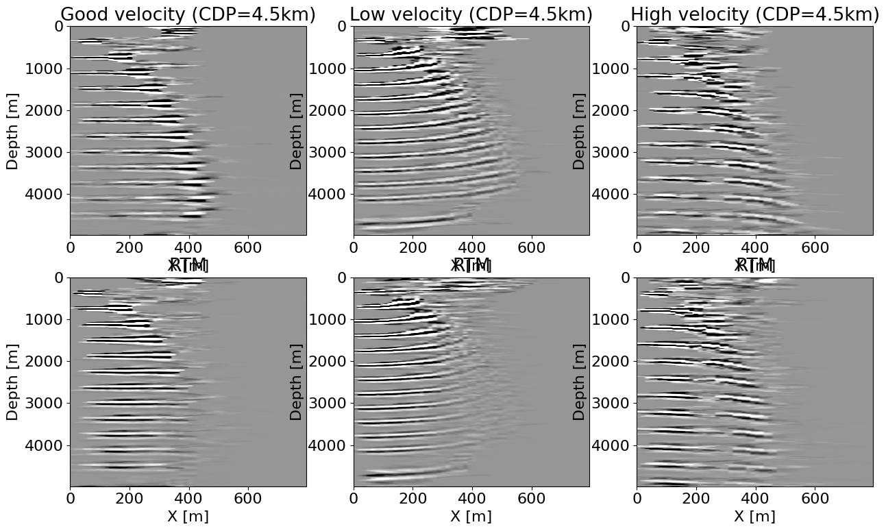

 

# ImageGather.jl

This package implements image gather functions for seismic inversion and QC. We currently only implemented surface gathers via the double RTM method (put ref) for QC on inverted velocity models.

# Example

A simple example of surface image gather for a layered model can be found in `examples/layers_cig.jl`. This examples produces the following image gathers:

: Offset gather for a good and bad background velocity model at different position along X.

This first plot shows the expected behavior with respect to the offset. We clearly see the flat events with a correct velocity while we obtain the predicted upwards and downwards parabolic events for a respectively low and high velocity at large offset.

: Stack of offset gather along the X direction showing the difference in flatness and alignmement for a goood and bad background velocity model.

This second plot show the stck along X of different gathers that shows the focusing onto the reflectors with a correct velocity while the high and low velocity models produce unfocused and missplaced events.

# Contributions

Contributions are welcome.

# References

This work is inspired byt the original double RTM [paper](https://library.seg.org/doi/pdfplus/10.1190/segam2012-1007.1):

- Matteo Giboli, Reda Baina, Laurence Nicoletis, and Bertrand Duquet, "Reverse Time Migration surface offset gathers part 1: a new method to produce ‘classical’ common image gathers", SEG Technical Program Expanded Abstracts 2012.

# Authors

This package is developed and maintained by Mathias Louboutin <mlouboutin3@gatech.edu>
