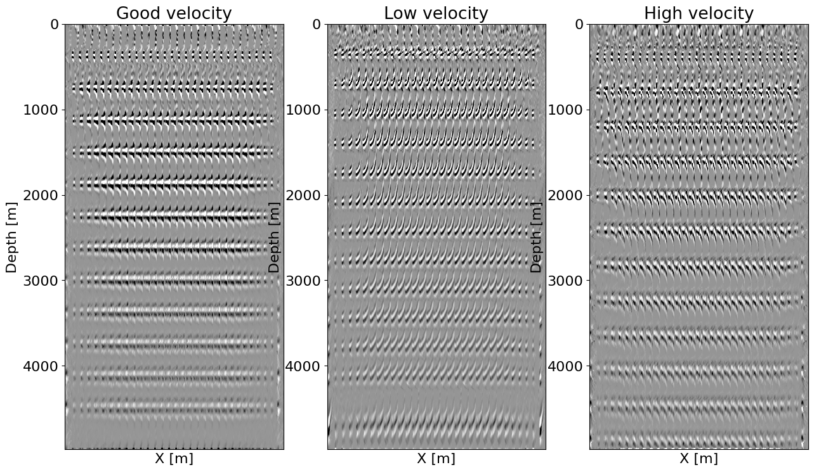

 

# ImageGather.jl

This package implements image gather functions for seismic inversion and QC. We currently offer surface gathers via the double RTM method and subsurface offset image gather. The subsurface offset common image gather are implemented via the extended born modeling operator and its adjoint allowing for extended LSRTM.

# Example

A simple example of a surface image gather for a layered model can be found in `examples/layers_cig.jl`. This example produces the following image gathers:

: Offset gather for a good and bad background velocity model at a different position along X.

This first plot shows the expected behavior with respect to the offset. We clearly see the flat events with a correct velocity while we obtain the predicted upwards and downwards parabolic events for a respectively low and high velocity at large offset.

: Stack of offset gather along the X direction showing the difference in flatness and alignment for a good and bad background velocity model.

This second plot shows the stack along X of different gathers that shows the focusing onto the reflectors with a correct velocity while the high and low-velocity models produce unfocused and misplaced events.

# Contributions

Contributions are welcome.

# References

This work is inspired by the original [double RTM](https://library.seg.org/doi/pdfplus/10.1190/segam2012-1007.1) paper for the surface gather and the [Extended Born]() paper for extended jacobian for subsurface gathers.

- Matteo Giboli, Reda Baina, Laurence Nicoletis, and Bertrand Duquet, "Reverse Time Migration surface offset gathers part 1: a new method to produce ‘classical’ common image gathers", SEG Technical Program Expanded Abstracts 2012.
- Raanan Dafni, William W Symes, "Generalized reflection tomography formulation based on subsurface offset extended imaging",
Geophysical Journal International, Volume 216, Issue 2, February 2019, Pages 1025–1042, https://doi.org/10.1093/gji/ggy478

# Authors

This package is developed and maintained by Mathias Louboutin <mlouboutin3@gatech.edu>
